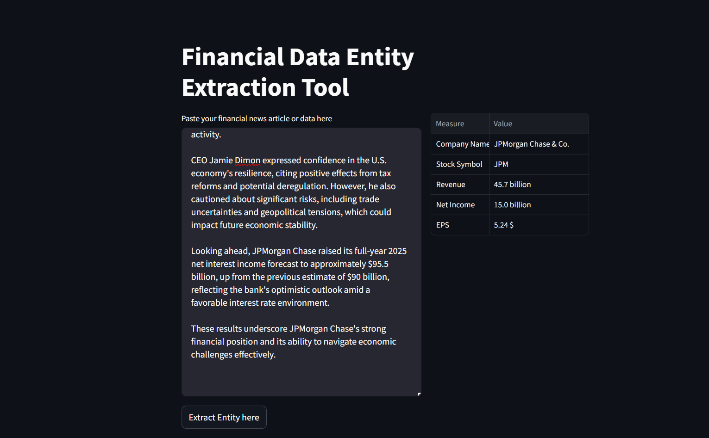

# Financial Data Entity Extraction Tool

This project uses **OpenAI's GPT-3.5** model to extract key financial data (like **company name, revenue, net income, EPS**, and **stock symbol**) from financial news articles.

It features:
- A backend script using the **OpenAI API**
- A simple and interactive **Streamlit web app**
- JSON-based structured output rendered in a table format

---

## Demo

Paste a financial news article, click a button, and get structured financial metrics in a table!

 
---

## Features

- Input any financial news article
- Automatically extracts:
  - Company Name
  - Stock Symbol
  - Revenue
  - Net Income
  - Earnings Per Share (EPS)
- Outputs the data in a clean table using pandas and Streamlit
- Handles missing or unstructured data safely

---
